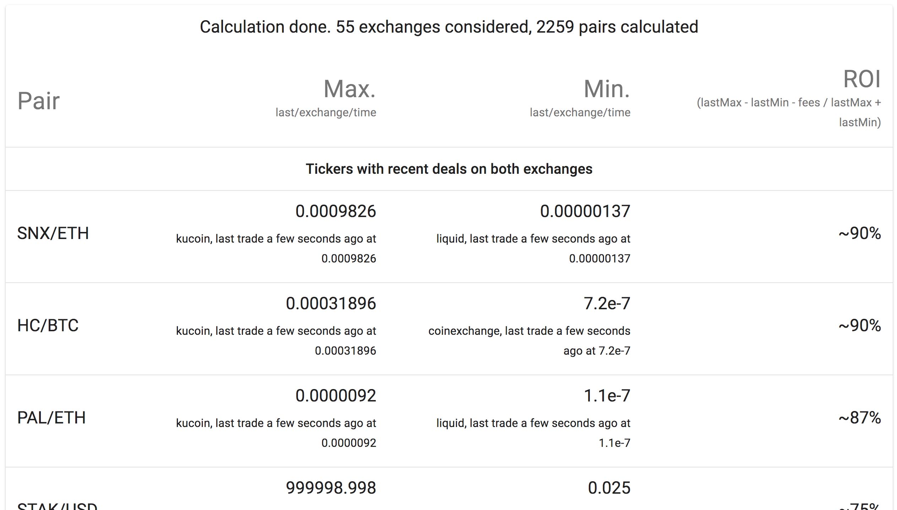

# Cryptools

> An arbitrage tool based on awesome [ccxt][https://github.com/ccxt/ccxt]. Query ~55 exchanges to get about 2000 common pairs and calculate quote differencies to get best arbitrage opportunities



## Installation

```sh
git clone https://github.com/Dvorson/cryptools.git
cd cryptools
npm i
npm run build
npm start
```

## Usage example

Go to http://localhost:8080 to get an aggregated overview table for current pairs with best ROI (Return on investment) potential

## Release History

* 0.1.0
    * Work in progress

## Contributing

1. Fork it (<https://github.com/Dvorson/cryptools/fork>)
2. Create your feature branch (`git checkout -b feature/fooBar`)
3. Commit your changes (`git commit -am 'Add some fooBar'`)
4. Push to the branch (`git push origin feature/fooBar`)
5. Create a new Pull Request
